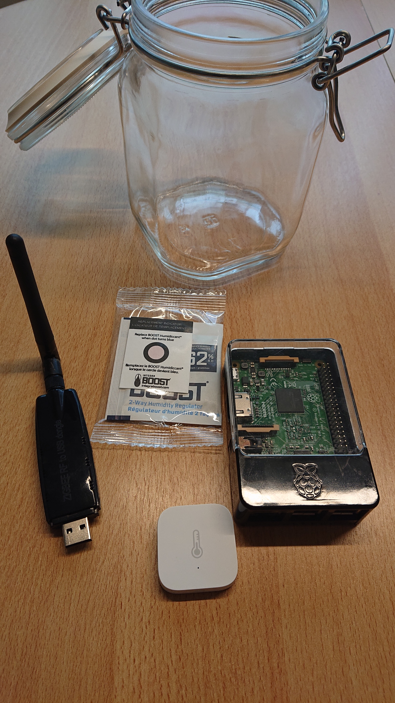

# Cure logger
The aim of this project is to monitor the curing of cannabis flowers using the Aqara humidity, pressure and temperature sensor (WSDCGQ11LM).

The ruby script subscribes topic of the sensors and saves the events payload in a CSV file for further analysis.

# Requirements
- MQTT Broker handles the events from Zigbee2mqtt
- Ruby 2.7 or better

# Installation
1. Clone the ropository `git clone https://github.com/gurix/cure_logger.git`
2. Install dependencies `bundle install`
3. `cp config.yaml.example config.yaml`
4. Setup your sensors and configure address of your MQTT broker in `config.yaml`

# Run the script
Start the script with `ruby logger.rb` that produces console output when an event happens as well as it logs data into `data.csv`.

# Data Analysis
Running `data_analysis/report.sh` generates you a report containing plots of humidity and temperature of the last 48 hours. You need to install R and some additional packages to run this command. 

